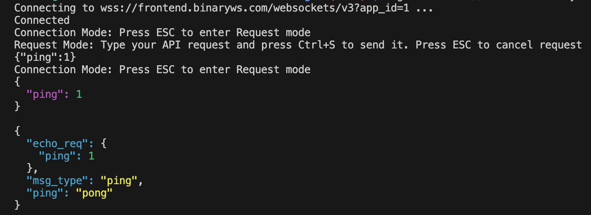

# wsget

[](https://github.com/ksysoev/wsget/actions/workflows/main.yml)
[](https://codecov.io/gh/ksysoev/wsget)
[](https://goreportcard.com/report/github.com/ksysoev/wsget)
[](https://opensource.org/licenses/MIT)

wsget is a command-line tool for interacting with a WebSocket server. It supports plain text and  json messages, and can save the output of session into file.

## Installation

To install wsget, you can use `go install`:

```
go install github.com/ksysoev/wsget/cmd/wsget@latest
```

## Usage

To use wsget, you need to specify the WebSocket URL using the -u flag:

```
wsget -u "wss://ws.postman-echo.com/raw"
```

By default, wsget will print the data received from the WebSocket server only to the console. You can also save the data to a file using the -o flag:

```
wsget -u "wss://ws.postman-echo.com/raw"  -o output.txt
```



## License

wsget is licensed under the MIT License. See the LICENSE file for more information.